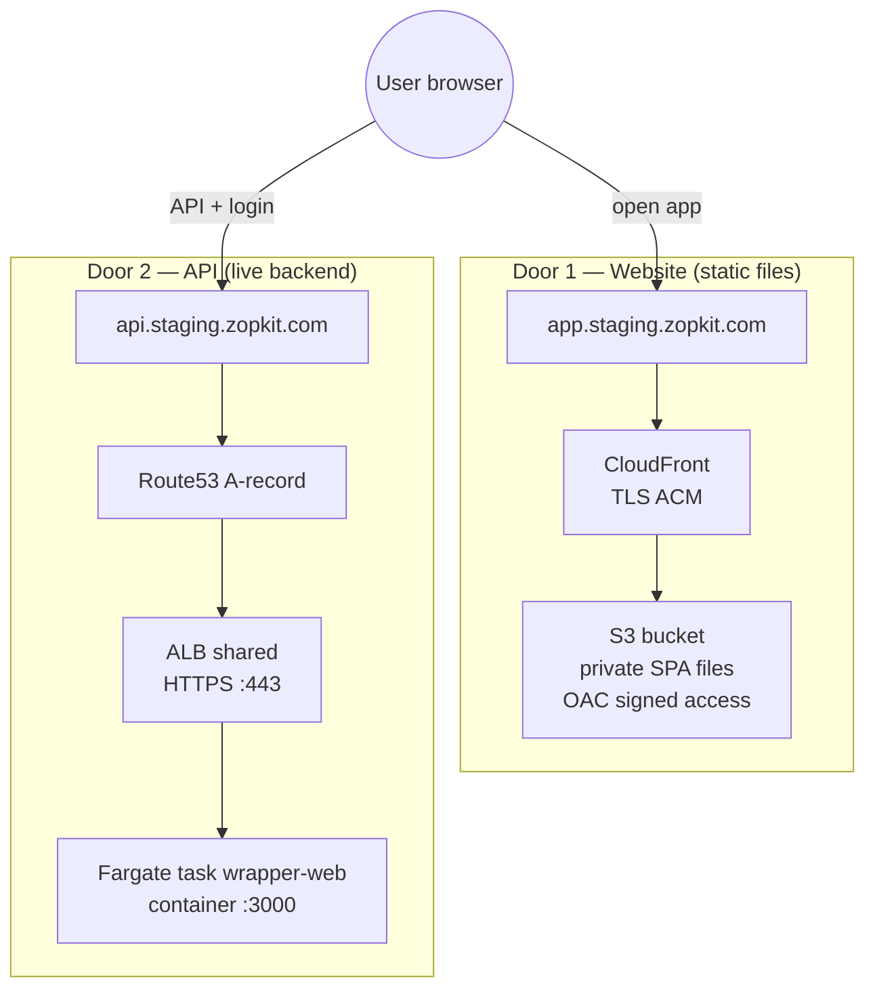
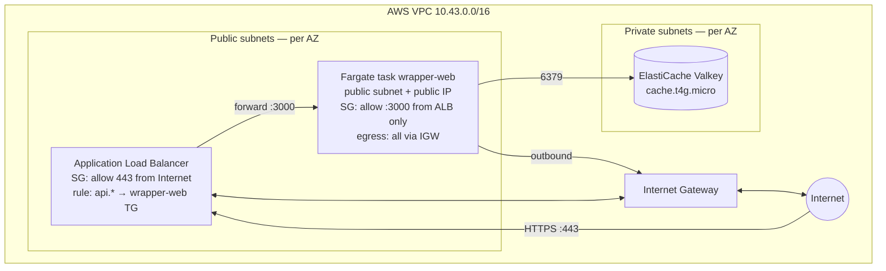
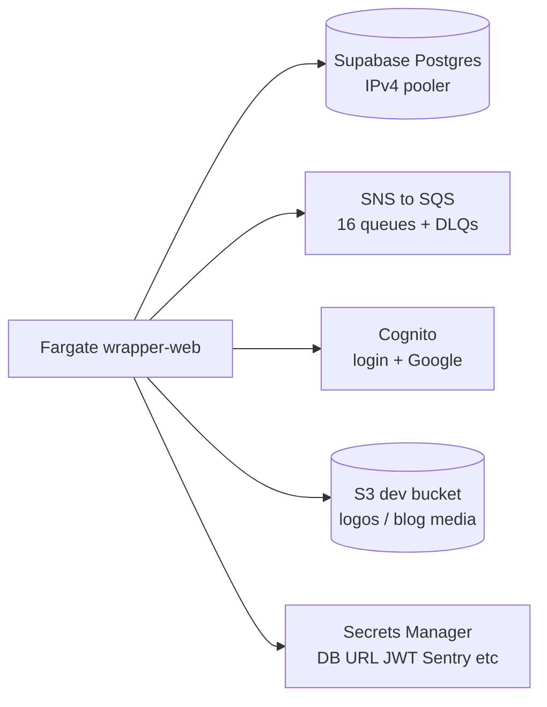
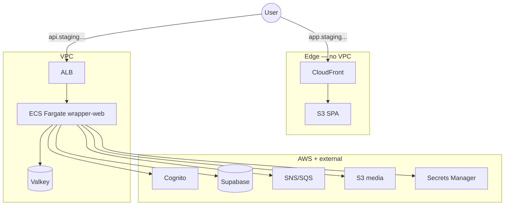
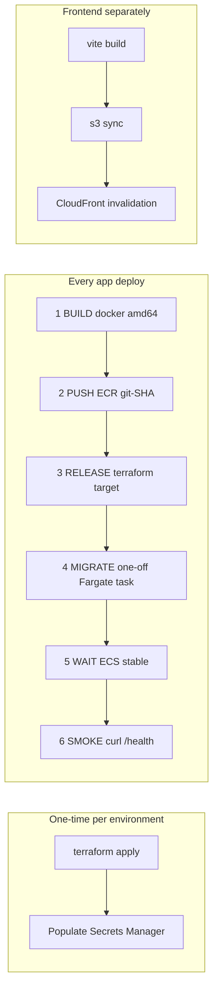
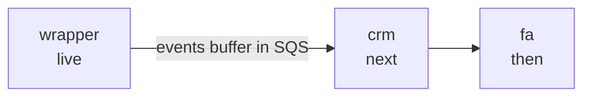
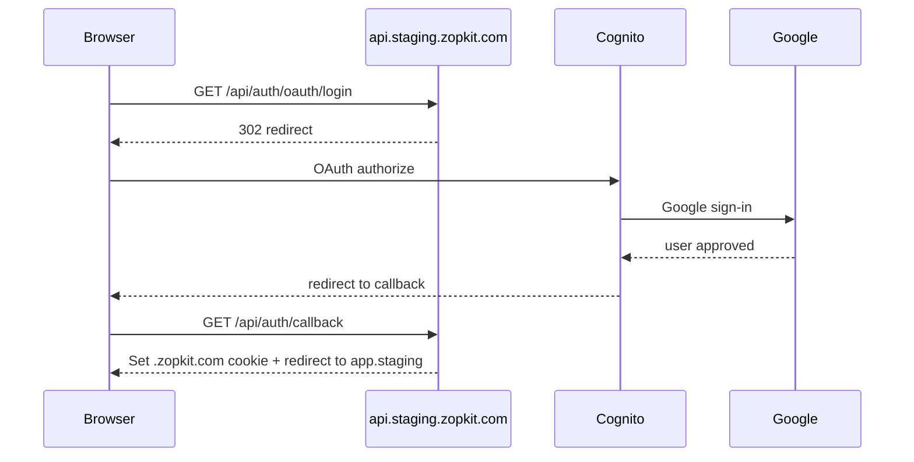

# Architecture — Zopkit Suite on AWS (ECS Fargate)

Visual guide for developers. Operational steps: [`PLAYBOOK.md`](./PLAYBOOK.md).  
**Current environment:** `zopkit-staging` · account `207567767101` · `us-east-1` · `staging.zopkit.com`

> **Compute:** ECS Fargate (not EKS). Three apps (wrapper / crm / fa); **only wrapper is live** in staging — crm/fa are defined but `enabled=false`.

---

## 1. Two doors into the product

Every user hits **two separate paths**. They never merge in the network — only in the browser (the SPA calls the API).

| Path | Hostname | What happens |
|------|----------|--------------|
| **Frontend** | `app.staging.zopkit.com` | CloudFront → private S3. HTML/JS/CSS only. **Does not enter the VPC.** |
| **Backend** | `api.staging.zopkit.com` | Route53 → ALB → Fargate container. Handles auth, DB, events, files. |

After the SPA loads from CloudFront, the browser calls `https://api.staging.zopkit.com/...` for data and login.

---

## 2. API path — inside the VPC

Staging VPC: **`10.43.0.0/16`**, **2 AZs**, **no NAT gateway** (tasks use public IPs for outbound).

**Security model (the important part):**

| Resource | Who can reach it |
|----------|------------------|
| **ALB** | Internet on port **443** |
| **Fargate task** | **Only the ALB** on port 3000 — not the Internet directly |
| **Valkey** | **Only Fargate tasks** on port 6379 |
| **Public IP on task** | Used for **outbound** (ECR pull, Supabase, AWS APIs) — inbound is blocked by SG |

**Why no NAT in staging:** cheaper. Tasks sit in **public subnets** with a public IP and egress via IGW. Production should use **private subnets + NAT** (`fargate_assign_public_ip = false`).

**Other services (crm-web, fa-web, fa-consumer):** defined in Terraform, `enabled=false` until you roll them out.

---

## 3. What the API talks to (outside the VPC)

| Service | Purpose in staging |
|---------|-------------------|
| **Supabase** | Shared **dev** Postgres via pooler (`aws-0-ap-south-1.pooler.supabase.com`) |
| **SNS → SQS** | Event bus to CRM/FA (queues exist; consumers deploy later) |
| **Cognito** | Shared pool `zopkit-platform` + Google OAuth |
| **S3** | Shared dev bucket `wrapper-tenant-logos` |
| **Secrets Manager** | Injected into task at runtime — never baked into Docker image |

---

## 4. End-to-end (one picture)

---

## 5. Deployment flow

**One command for backend:** `./deploy/ecs/deploy-service.sh wrapper-web`

**Rollback:** re-run deploy steps 1–5 with a **previous git SHA** (ECR tags are immutable).

---

## 6. Suite rollout order

Wrapper owns tenants, login, credits. CRM/FA consume its events. Their queues already exist.

**Add an app:** `enabled=true` in tfvars → `terraform apply` → `deploy-service.sh <svc>` → deploy that app's frontend.

---

## 7. Login flow

**Rule:** auth always goes to the **API host** (`api.…`), not relative `/api` (relative only works locally via Vite proxy).

---

## 8. Staging facts (quick reference)

| Item | Value |
|------|-------|
| Domain | `staging.zopkit.com` |
| VPC CIDR | `10.43.0.0/16` (2 AZs, NAT-less) |
| ECS cluster | `zopkit-staging-ecs` |
| Running service | `zopkit-staging-wrapper-web` (1 task) |
| Frontend | `app.staging.zopkit.com` → CloudFront `E34U1BABF6H31O` → S3 `zopkit-staging-wrapper-fe` |
| API | `api.staging.zopkit.com` → ALB → Fargate `:3000` |
| DB | Dev Supabase (IPv4 pooler) |
| Auth | Cognito `us-east-1_6e8AY4eMj` + Google |
| Messaging | SNS ×3 → SQS ×16 (+ DLQs) |
| Tracing | Sentry org `zopkit-cg` |

---

## 9. Glossary

| Term | Meaning |
|------|---------|
| **ECR** | Docker image registry |
| **ECS / Fargate** | Runs containers without managing EC2 |
| **ALB** | Load balancer; routes `api.…` by hostname to the right task |
| **Task definition** | Container recipe (image + env + secrets). **Service** keeps N tasks running. |
| **VPC / subnet / SG** | Private network / AZ slices / per-resource firewall |
| **IGW / NAT** | Internet Gateway (public subnet in/out) / NAT (private subnet outbound only) |
| **CloudFront + OAC** | CDN + signed access to private S3 |
| **SNS → SQS** | Publish once, many queues receive; DLQ catches failures |
| **Secrets Manager** | Secrets injected at task start |
| **Terraform** | Infrastructure as code; `terraform apply` updates AWS |

---

## Related docs

- **Deploy steps:** [`ecs/terraform/README.md`](./ecs/terraform/README.md)
- **Full suite (EKS alternative, unused):** older `deploy/terraform/` EKS stack — left untouched; ECS is the active path.
