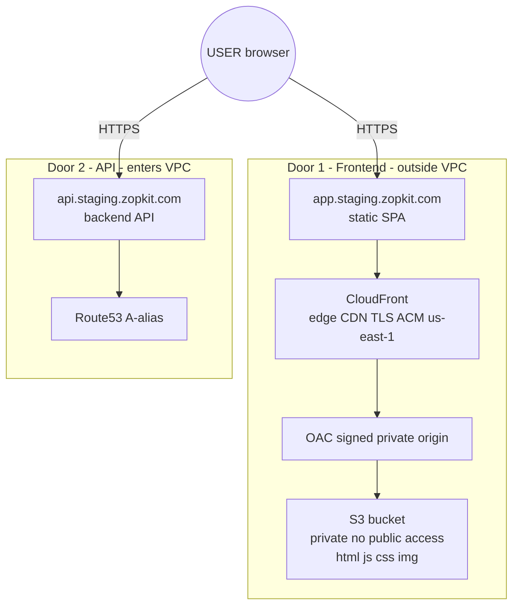
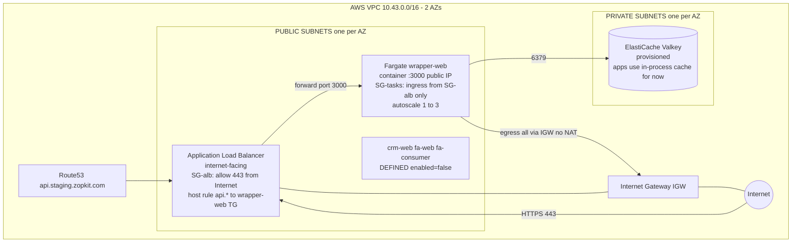
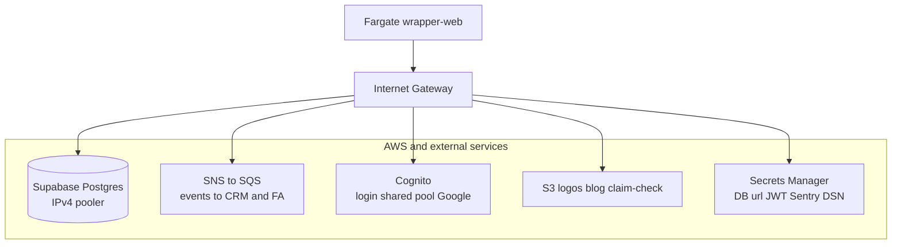
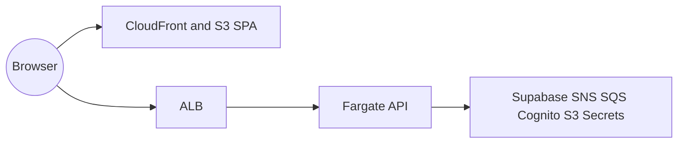
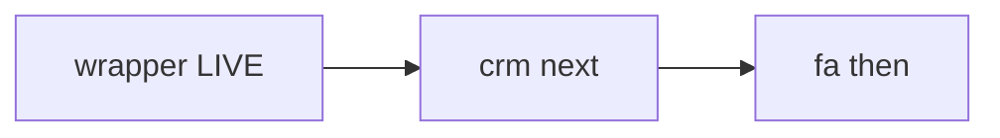
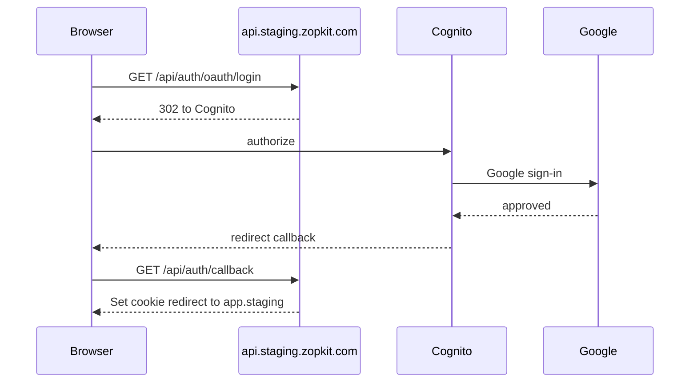

# Infrastructure Overview — Zopkit Staging (ECS Fargate)

Visual guide for developers. Deploy steps: [`PLAYBOOK.md`](./PLAYBOOK.md).  
**Environment:** `zopkit-staging` · `207567767101` · `us-east-1` · `staging.zopkit.com`

---

## 1. Detailed network path (user to CloudFront to VPC to ALB to Fargate)

**Read as two independent doors into the same product:**

- **`app.staging.zopkit.com`** — website (static SPA). CloudFront to S3. **Never enters the VPC.**
- **`api.staging.zopkit.com`** — backend API. Route53 to ALB to Fargate. **Inside the VPC.**

### 1a. Both doors from the user

### 1b. API path inside the VPC

Staging VPC: **`10.43.0.0/16`**, **2 AZs**, **no NAT** (Fargate tasks in public subnets, egress via IGW).

### 1c. Outbound from Fargate (via IGW)

### Security groups (the firewall)

| Resource | Rule |
|----------|------|
| **ALB** | Internet may connect on **443** |
| **Fargate task** | **Only ALB** may connect on **3000** — not the Internet directly |
| **Public IP on task** | For **outbound** only (ECR, Supabase, AWS APIs) in this no-NAT staging setup |
| **Valkey** | Only Fargate tasks on **6379** |

**Why no NAT in staging:** cheaper. Tasks run in public subnets with a public IP. Production should use **private subnets + NAT** (`fargate_assign_public_ip = false` in tfvars).

---

## 2. High-level mental model

Frontend = files on a CDN. Backend = container behind a load balancer. Two subdomains, all HTTPS.

---

## 3. Deployment flow

```mermaid
flowchart TB
  subgraph once["One-time per environment"]
    tf["terraform apply"]
    sec["populate Secrets Manager"]
    tf --> sec
  end

  subgraph ship["Every deploy deploy-service.sh wrapper-web"]
    b1["1 BUILD docker linux amd64"]
    b2["2 PUSH ECR git-SHA tag"]
    b3["3 RELEASE terraform apply -target service"]
    b4["4 MIGRATE one-off Fargate task"]
    b5["5 WAIT ECS stable"]
    b6["6 SMOKE curl api health 200"]
    b1 --> b2 --> b3 --> b4 --> b5 --> b6
  end

  subgraph fe["Frontend separately"]
    v["vite build"]
    s["aws s3 sync"]
    i["cloudfront invalidation"]
    v --> s --> i
  end
```

**Rollback:** re-run steps 1-5 with a **previous git SHA**.

---

## 4. Suite rollout order

Wrapper owns tenants, login, credits. SQS queues already exist so events buffer until CRM/FA deploy.

---

## 5. Login flow

**Rule:** auth calls go to **`api.staging.zopkit.com`**, not relative `/api` (relative only works locally via Vite proxy).

---

## 6. Staging facts

| Item | Value |
|------|-------|
| AWS account / region | `207567767101` / `us-east-1` |
| Domain | `staging.zopkit.com` |
| VPC | `10.43.0.0/16`, 2 AZs, NAT-less |
| ECS cluster | `zopkit-staging-ecs` |
| Running service | `zopkit-staging-wrapper-web` (1 task) |
| Frontend | `app.staging.zopkit.com` to CloudFront `E34U1BABF6H31O` to S3 `zopkit-staging-wrapper-fe` |
| API | `api.staging.zopkit.com` to ALB to Fargate :3000 |
| DB | dev Supabase IPv4 pooler `aws-0-ap-south-1.pooler.supabase.com` |
| Auth | Cognito `us-east-1_6e8AY4eMj` + Google |
| Object storage | dev bucket `wrapper-tenant-logos` |
| Messaging | SNS x3 to SQS x16 + DLQs |
| Tracing | Sentry org `zopkit-cg` |

---

## 7. Glossary

| Term | Meaning |
|------|---------|
| ECR | Docker image registry |
| ECS / Fargate | Runs containers without managing EC2 |
| ALB | Load balancer routes api.* by hostname |
| Task definition | Container recipe. Service keeps N tasks running |
| VPC / subnet / SG | Network / AZ slice / firewall |
| IGW / NAT | Internet Gateway / NAT for private subnet egress |
| CloudFront + OAC | CDN + signed access to private S3 |
| SNS to SQS | Event bus with DLQs |
| Secrets Manager | Secrets injected at task start |
| Terraform | Infrastructure as code |

---

## Related docs

- [`ARCHITECTURE.md`](./ARCHITECTURE.md) — same diagrams, extended notes
- [`system-architecture.md`](./system-architecture.md) — shorter overview
- [`ecs/terraform/README.md`](./ecs/terraform/README.md) — Terraform apply order
