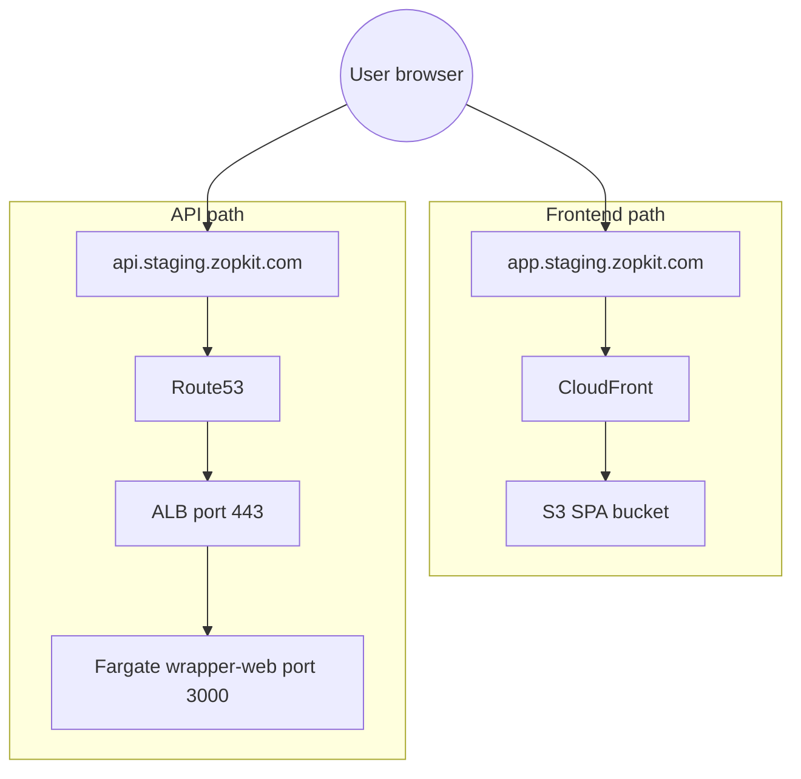
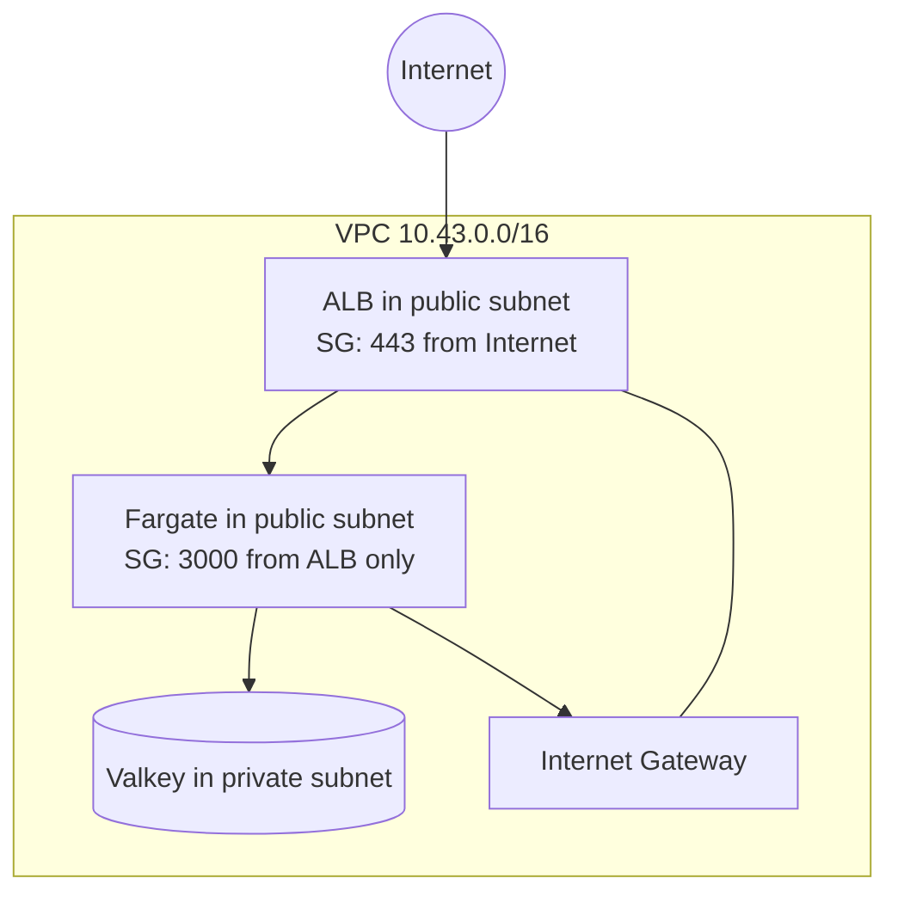
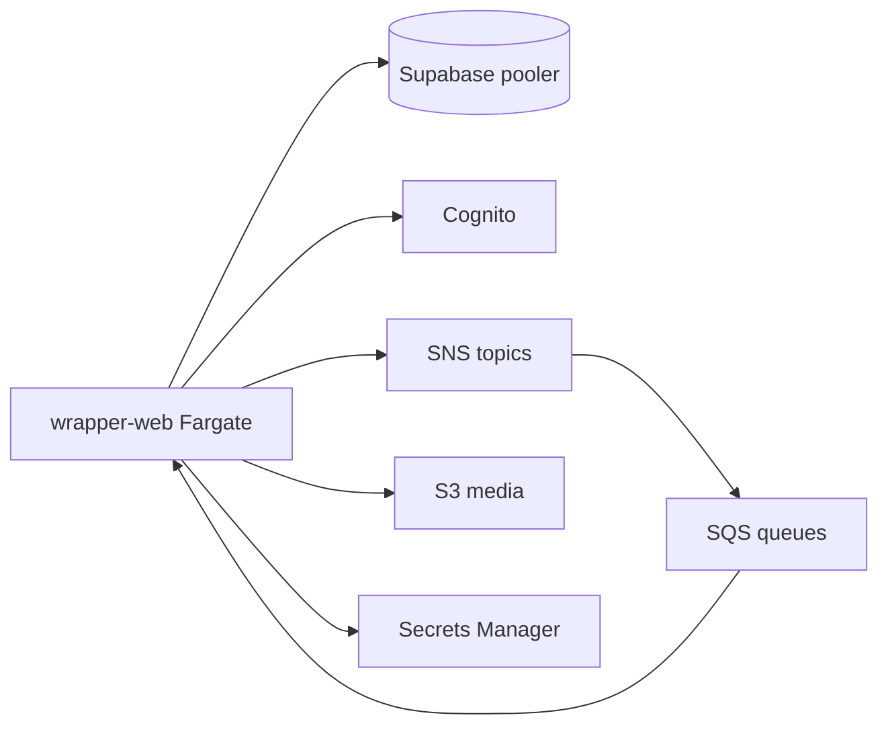
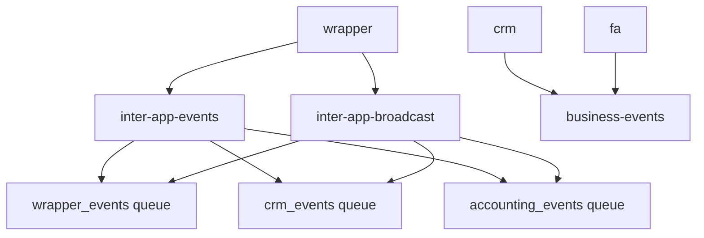
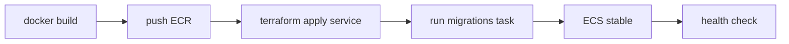

# Zopkit Suite - System Architecture

**Live stack:** ECS Fargate on AWS (not EKS).  
**Staging:** `staging.zopkit.com` · VPC `10.43.0.0/16` · cluster `zopkit-staging-ecs`  
**Apps:** wrapper (live), crm + fa (defined, `enabled=false` until rollout)

Deploy steps: [`PLAYBOOK.md`](./PLAYBOOK.md) · More detail: [`ARCHITECTURE.md`](./ARCHITECTURE.md)

---

## 1. Big picture

| Piece | Role |
|-------|------|
| Route53 | DNS for `app.` and `api.` hostnames |
| CloudFront + S3 | Static React SPAs (private bucket, OAC) |
| ALB | One shared HTTPS load balancer for APIs |
| ECS Fargate | Runs wrapper / crm / fa containers |
| Cognito | Login (shared pool + Google) |
| Valkey | Permission/auth cache |
| Supabase | Postgres (external, per app) |
| SNS + SQS | Async events between apps |
| Secrets Manager | DB URLs, JWT keys, etc. |

**Two traffic paths:**

1. **Website** - `app.staging.zopkit.com` -> CloudFront -> S3 (never enters VPC)
2. **API** - `api.staging.zopkit.com` -> ALB -> Fargate task (inside VPC)

---

## 2. User request flow

| URL | Destination |
|-----|-------------|
| `app.staging.zopkit.com` | CloudFront -> S3 |
| `api.staging.zopkit.com` | ALB -> Fargate |
| `crm.staging.zopkit.com` | CloudFront (when CRM frontend deployed) |
| `crm-api.staging.zopkit.com` | ALB -> crm Fargate (when enabled) |

---

## 3. VPC layout (API path)

Staging: **2 AZs**, **no NAT**, Fargate tasks in **public subnets** with public IP (outbound only via SG).

| Firewall rule | Meaning |
|---------------|---------|
| ALB SG | Internet can hit HTTPS 443 |
| Task SG | Only ALB can hit port 3000 |
| Valkey SG | Only Fargate tasks on 6379 |

---

## 4. What the API calls

---

## 5. Messaging (SNS to SQS)

No EventBridge. Two buses:

| Bus | Topics | Publisher |
|-----|--------|-----------|
| Platform | `inter-app-events`, `inter-app-broadcast` | wrapper |
| Business | `business-events` | crm, fa |

**Loop-guard:** business-events queues filter out messages where `sourceSystem` is the same app.

**FA consumer:** accounting queues are read by the separate `fa-consumer` Fargate service (when enabled).

---

## 6. Deploy flow

One-shot: `./deploy/ecs/deploy-service.sh wrapper-web`

Frontend: `vite build` -> `aws s3 sync` -> CloudFront invalidation

---

## 7. Service inventory (staging)

| Layer | Resource | Notes |
|-------|----------|-------|
| Network | VPC 10.43.0.0/16, IGW, 2 AZs | No NAT in staging |
| Compute | ECS Fargate cluster | wrapper-web running |
| Edge | ALB + CloudFront x3 + ACM | Shared ALB |
| Auth | Cognito pool | Google OAuth |
| Cache | Valkey cache.t4g.micro | 0 replicas |
| Registry | ECR x3 | Immutable SHA tags |
| Messaging | SNS x3, SQS x16 + DLQs | Queues pre-created |
| Storage | S3 SPA + data buckets | OAC on frontends |
| Secrets | Secrets Manager | Injected into tasks |
| External | Supabase dev DB | Not in Terraform |

---

## Related

- [`ARCHITECTURE.md`](./ARCHITECTURE.md) - login flow, glossary, staging facts
- [`ecs/terraform/README.md`](./ecs/terraform/README.md) - Terraform apply order
- [`../frontend/docs/architecture.md`](../frontend/docs/architecture.md) - React app structure
