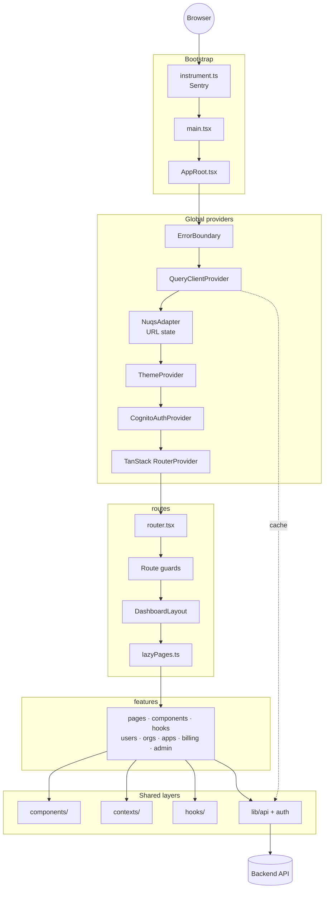
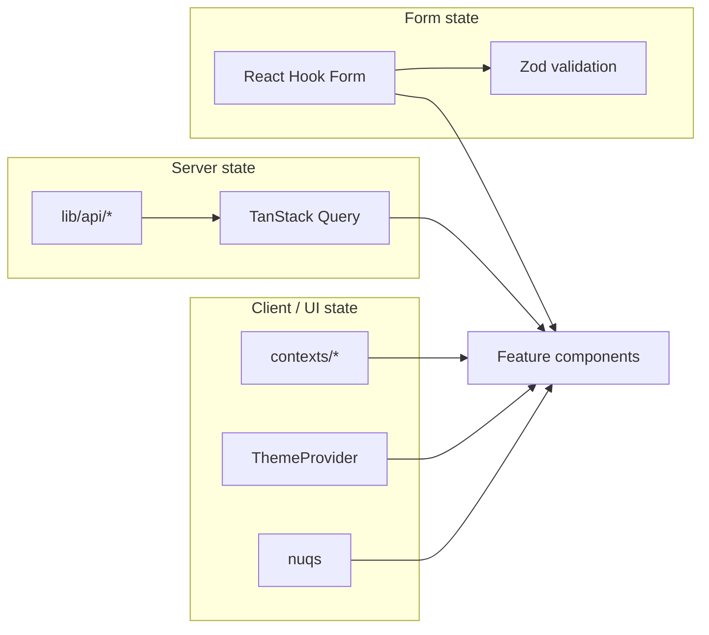

# Architecture Overview

## Project Structure

This project follows a **feature-based architecture** with clear separation of concerns:

```
src/
├── components/           # Shared UI (ui, layout, auth, forms, common, …)
├── features/             # Feature-scoped pages, components, hooks
├── routes/               # TanStack Router config + lazy-loaded pages
├── contexts/             # React context (user, entity scope, breadcrumbs)
├── lib/                  # API client, auth, utilities
├── hooks/                # Global custom hooks
├── types/                # Shared TypeScript types
├── errors/               # Top-level error boundary
├── services/             # Cross-cutting services (e.g. notifications)
└── data/                 # Static / bridge data
```

## Application Layers



## State Management



## Layer inventory (quick reference)

| Layer     | Location                                   | Role                                       |
| --------- | ------------------------------------------ | ------------------------------------------ |
| Bootstrap | `main.tsx`, `AppRoot.tsx`, `instrument.ts` | chunk recovery, provider tree, Sentry init |
| Routing   | `routes/router.tsx`, `routes/lazyPages.ts` | TanStack Router, lazy pages, guards        |
| Features  | `src/features/*`                           | Domain UI (users, orgs, billing, admin, …) |
| Shared UI | `src/components/*`                         | ShadCN, layout, forms, auth shells         |
| Context   | `src/contexts/*`                           | User session, entity scope, breadcrumbs    |
| API       | `src/lib/api/*`, `src/lib/auth/*`          | HTTP client, Cognito auth                  |
| Errors    | `src/errors/*`                             | Top-level error boundary                   |

> **Infrastructure** (ECS Fargate, ALB, CloudFront, Cognito, SNS/SQS, RDS): see
> [`deploy/ARCHITECTURE.md`](../../deploy/ARCHITECTURE.md).

## Key Architectural Patterns

### 1. Feature-Based Organization

- Each feature contains its own components, hooks, and services
- Promotes code locality and maintainability
- Enables independent development and testing

### 2. State Management

- **Server State**: TanStack Query for API data and caching
- **Client State**: React context for session-scoped data (user, entity scope); ThemeProvider for theme
- **Form State**: React Hook Form with Zod validation
- **URL State**: TanStack Router + nuqs for navigation and query parameters

### 3. Component Architecture

- **UI Components**: Reusable, design system components
- **Layout Components**: Application shell and navigation
- **Feature Components**: Business logic components
- **Page Components**: Route-level components (lazy-loaded from `routes/lazyPages.ts`)

### 4. Error Handling

- **Error Boundaries**: Catch and handle React errors
- **API Error Handling**: Centralized error handling with user feedback
- **Validation**: Runtime validation with Zod schemas

## Technology Stack

- **React 19** with TypeScript
- **TanStack Router** for client-side routing
- **TanStack Query** for server state management
- **React Hook Form** with Zod for forms
- **nuqs** for URL search-param state
- **Tailwind CSS** for styling
- **ShadCN UI** for component library
- **Vite** for build tooling

## Performance Optimizations

- **Code Splitting**: Lazy-loaded routes and components
- **Bundle Optimization**: Manual chunk splitting for better caching
- **Query Optimization**: Proper staleTime and gcTime configuration
- **Memoization**: React.memo, useMemo, useCallback for expensive operations

## Development Workflow

1. **Feature Development**: Create feature in `src/features/`
2. **Component Development**: Use ShadCN UI components as base
3. **State Management**: Use appropriate state management solution
4. **Testing**: Unit tests with Vitest
5. **Documentation**: Update component documentation in Storybook
